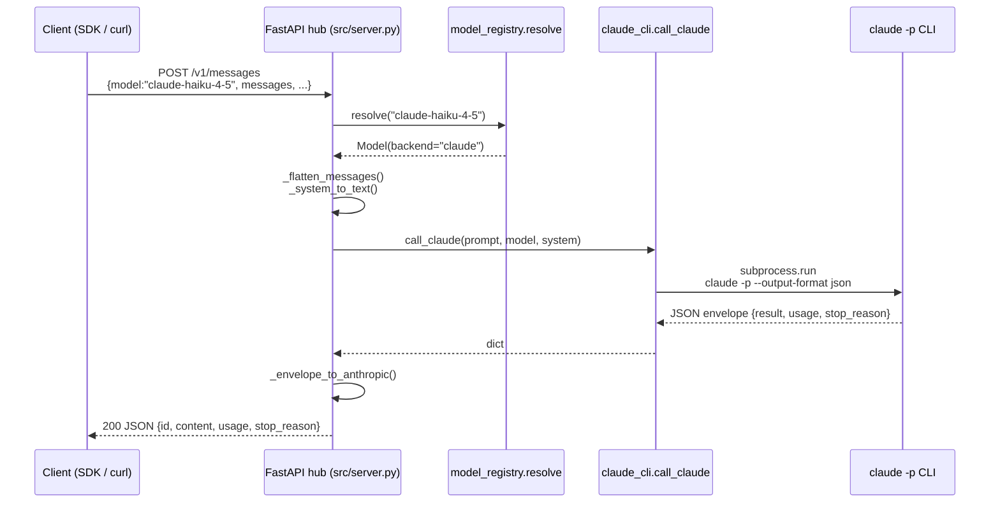
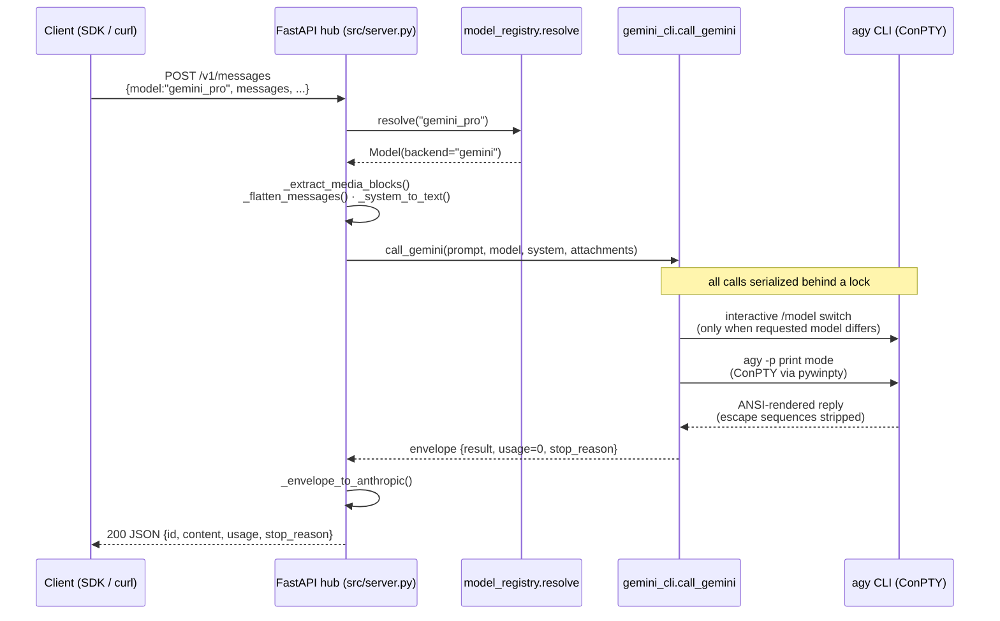
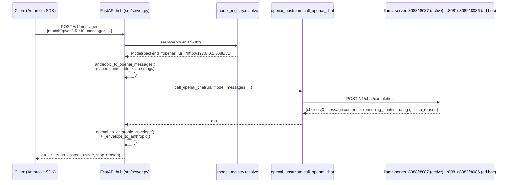

# Project structure

An LLM-oriented map of `local-llm-hub`. Three views: a **component
diagram** showing runtime data flow between clients, the hub, and the
backends (Claude subscription via the `claude -p` CLI + Gemini
subscription via the `agy` Antigravity CLI + local llama-server
processes for Qwen3.5-9B, GLM-4.5-Air, Gemma 4 E4B, Gemma 4 26B-A4B +
whisper.cpp ASR for both transcribe (turbo, GPU) and translate
(medium, CPU)); a **module
diagram** showing the Python package layout and imports; and a
**request lifecycle** sequence. Use this file as context when asking
an LLM to modify the project — it shows which file owns what, and what
talks to what. For per-model specs, quantisation, and docs links see
[model-comparison.md](model-comparison.md).

## Component diagram (runtime)

```mermaid
flowchart LR
    subgraph Clients["External clients"]
        SDK["anthropic SDK<br/>(base_url=127.0.0.1:8000)"]
        OAI["openai SDK<br/>(base_url=127.0.0.1:8000/v1)"]
        CURL["raw HTTP / curl"]
        LAN["LAN clients<br/>(other machines, openclaw)"]
    end

    subgraph UI["Admin SPA (app_web/) — sub-app mounted at /admin"]
        WSRV["app_web/server.py<br/>create_app() sub-app<br/>versioned static + bearer auth"]
        WROUT["app_web/routers/<br/>hub · models · playground · services<br/>telemetry · code_usage<br/>auth · webauthn · version · misc"]
        WSTATIC["app_web/static/<br/>index.html SPA + per-tab JS<br/>tabs: Hub · Models · Play · OTel · Code"]
    end

    subgraph Hub["FastAPI hub (src/)"]
        SRV["src/server.py<br/>POST /v1/messages<br/>POST /v1/chat/completions<br/>GET /v1/models /health /info<br/>GET / → 307 /admin/<br/>mounts /admin sub-app"]
        REG["src/model_registry.py<br/>YAML → Model rows"]
        HP["src/host_profile.py<br/>resolve active host"]
        CLI_WRAP["src/claude_cli.py<br/>call_claude()"]
        GEM_WRAP["src/gemini_cli.py<br/>call_gemini()<br/>serialized model switch + ConPTY"]
        OAI_UP["src/openai_upstream.py<br/>call_openai_chat()<br/>+ shape translators"]
    end

    subgraph Procs["Process managers"]
        SP["src/server_process.py<br/>hub Popen + log ring<br/>+ kill-port helper"]
        LP["src/backend_process.py<br/>per-model llama-server + whisper-server<br/>Popen + log ring"]
    end

    CLAUDE["claude -p CLI<br/>(Claude Code subscription)"]
    GEMINI["agy Antigravity CLI<br/>(Google AI Pro/Ultra subscription)<br/>ConPTY-hosted · Pro/Flash/Flash-Lite"]
    QWEN4B["llama-server :8088<br/>Qwen3.5-4B GGUF (agentic_light)<br/>all layers on GPU"]
    GEMMA426["llama-server :8087<br/>Gemma 4 26B-A4B IT GGUF (MoE, agentic_heavy)<br/>all layers on GPU (IQ4_XS)"]
    QWEN["llama-server :8081<br/>Qwen3.5-9B GGUF (ad-hoc)<br/>all layers on GPU"]
    GLM["llama-server :8082<br/>GLM-4.5-Air GGUF (ad-hoc)<br/>MoE experts on CPU"]
    GEMMA4E["llama-server :8086<br/>Gemma 4 E4B IT GGUF (fallback)<br/>all layers on GPU"]

    subgraph Dev["Dev / tests / scripts"]
        SMOKE["scripts/smoke_test.py<br/>iterate enabled_models()"]
        DLMODELS["scripts/download_models.py<br/>huggingface_hub"]
        DLLLAMA["scripts/install_llama_cpp.py<br/>CUDA-win / Metal-mac"]
        INSTALL_CLI["python -m src.install [--fix]"]
        TESTS["tests/test_server.py<br/>test_router.py<br/>test_model_registry.py<br/>test_install.py"]
    end

    CFG[("config/models.yaml<br/>hosts + models")]
    YAML_CACHE["models/<br/>GGUF files (gitignored)"]
    LLAMA_BIN["vendor/llama.cpp/<br/>llama-server binary"]

    SDK -->|POST /v1/messages| SRV
    OAI -->|POST /v1/chat/completions| SRV
    CURL -->|both shapes| SRV
    LAN -->|both shapes<br/>(0.0.0.0:8000)| SRV
    SMOKE -->|HTTP + SDK| SRV

    SRV -.->|mounts /admin| WSRV
    SRV --> REG
    REG --> HP
    REG -.reads.-> CFG
    HP -.reads.-> CFG

    SRV -->|backend=claude| CLI_WRAP
    SRV -->|backend=gemini| GEM_WRAP
    SRV -->|backend=openai| OAI_UP
    CLI_WRAP -->|subprocess.run<br/>--output-format json| CLAUDE
    GEM_WRAP -->|ConPTY (pywinpty)<br/>agy -p print mode| GEMINI
    OAI_UP -->|POST /v1/chat/completions| QWEN4B
    OAI_UP -->|POST /v1/chat/completions| GEMMA426
    OAI_UP -->|POST /v1/chat/completions| QWEN
    OAI_UP -->|POST /v1/chat/completions| GLM
    OAI_UP -->|POST /v1/chat/completions| GEMMA4E

    WSRV --> WROUT
    WSRV --> WSTATIC
    WROUT -->|hub tab: start/stop/logs<br/>kill stray PID| SP
    WROUT -->|models tab: start/stop/logs per model| LP
    WROUT -.->|play tab: httpx to /v1/messages| SRV

    SP -->|Popen python -m src.server| SRV
    LP -->|Popen llama-server --model ...| QWEN4B
    LP -->|Popen llama-server --model ...| GEMMA426
    LP -->|Popen llama-server --model ...| QWEN
    LP -->|Popen llama-server --model ...| GLM
    LP -->|Popen llama-server --model ...| GEMMA4E
    LP -.reads.-> LLAMA_BIN
    LP -.reads.-> YAML_CACHE

    DLMODELS -.writes.-> YAML_CACHE
    DLLLAMA  -.writes.-> LLAMA_BIN
    INSTALL_CLI -.dispatches.-> DLMODELS
    INSTALL_CLI -.dispatches.-> DLLLAMA

    TESTS -->|TestClient<br/>(monkeypatched)| SRV

    classDef ext fill:#2a2f3a,stroke:#555,color:#eee
    classDef hub fill:#1d2a1d,stroke:#4a7,color:#eee
    classDef ui fill:#2a1d2a,stroke:#a47,color:#eee
    classDef backend fill:#2a281d,stroke:#a94,color:#eee
    class Clients ext
    class CLAUDE,GEMINI,QWEN4B,GEMMA426,QWEN,GLM,GEMMA4E backend
    class Hub hub
    class UI ui
```

## Module diagram (filesystem)

```mermaid
flowchart TB
    ROOT["local-llm-hub/"]
    ROOT --> README["README.md"]
    ROOT --> REQ["requirements.txt"]
    ROOT --> LIC["LICENSE"]
    ROOT --> ROOTBAT["run_hub / tray / start_langfuse<br/>.bat (Windows) + .sh (macOS)<br/>(repo-root launchers)"]
    ROOT --> LAUNCHERS["launchers/<br/>run_qwen / run_glm / run_qwen35_4b / run_gemma4_e4b / run_gemma4_26b<br/>run_whisper / run_whisper_translate / run_all<br/>.bat (Windows) + .sh (macOS)"]

    ROOT --> CFGDIR["config/"]
    CFGDIR --> C1["models.yaml<br/>hosts + models registry"]

    ROOT --> SRC["src/"]
    SRC --> S1["server.py<br/>FastAPI hub + router (local backends + Claude + Gemini)"]
    SRC --> S2["claude_cli.py<br/>claude -p wrapper"]
    SRC --> S10["gemini_cli.py<br/>agy (Antigravity) CLI wrapper<br/>via ConPTY (pywinpty)"]
    SRC --> S3["openai_upstream.py<br/>llama-server client +<br/>Anthropic ↔ OpenAI shapes"]
    SRC --> S4["model_registry.py<br/>YAML loader + Model class"]
    SRC --> S5["host_profile.py<br/>pick active host row"]
    SRC --> S6["install.py<br/>checks + fix dispatch"]
    SRC --> S7["run_backend.py<br/>hub|qwen|glm|qwen35_4b|gemma4*|whisper dispatcher"]
    SRC --> S8["server_process.py<br/>hub Popen + kill-port"]
    SRC --> S9["backend_process.py<br/>per-model Popen (llama-server + whisper-server)"]
    SRC --> S11["whisper_translate_proxy.py<br/>FastAPI shim for optional lazy-load mode<br/>(dormant; whisper_translate runs eager)"]

    ROOT --> APPDIR["app_web/<br/>admin SPA sub-app (mounted at /admin)"]
    APPDIR --> A1["server.py<br/>create_app() + versioned static"]
    APPDIR --> A2["middleware.py / icons.py"]
    APPDIR --> A3["routers/"]
    A3 --> V1["hub.py / models.py / playground.py"]
    A3 --> V2["services.py / telemetry.py / code_usage.py"]
    A3 --> V3["auth.py / webauthn.py / version.py / misc.py"]
    APPDIR --> A4["static/"]
    A4 --> ST1["index.html<br/>SPA shell (Hub/Models/Play/OTel/Code)"]
    A4 --> ST2["main.js + per-tab JS<br/>(hub · models · playground · telemetry · code_usage)"]
    A4 --> ST3["styles.css + manifest + icons"]

    ROOT --> SCDIR["scripts/"]
    SCDIR --> SC1["smoke_test.py"]
    SCDIR --> SC2["download_models.py<br/>huggingface_hub"]
    SCDIR --> SC3["install_llama_cpp.py<br/>CUDA-win / Metal-mac"]

    ROOT --> TDIR["tests/"]
    TDIR --> T1["test_server.py"]
    TDIR --> T2["test_router.py"]
    TDIR --> T3["test_model_registry.py"]
    TDIR --> T4["test_install.py"]

    ROOT --> VENDOR["vendor/<br/>(gitignored)"]
    VENDOR --> VLL["llama.cpp/<br/>llama-server binary"]

    ROOT --> MDLS["models/<br/>(gitignored)"]
    MDLS --> M1["Qwen3.5-9B-Q4_K_M.gguf"]
    MDLS --> M2["GLM-4.5-Air-Q4_K_M/<br/>multi-part GGUF"]
    MDLS --> M3["Qwen3.5-4B-Q4_K_M.gguf (agentic_light)"]
    MDLS --> M4["gemma-4-E4B-it-Q4_K_M.gguf (fallback)"]
    MDLS --> M5["gemma-4-26B-A4B-it-UD-IQ4_XS.gguf (MoE; agentic_heavy)"]
    MDLS --> M6["ggml-large-v3-turbo.bin (whisper turbo, transcribe)"]
    MDLS --> M7["ggml-medium.bin (whisper medium, translate)"]

    ROOT --> DOCS["docs/"]
    DOCS --> D1["project-structure.md<br/>(this file)"]
    DOCS --> D2["model-comparison.md<br/>per-model specs + docs links"]
    DOCS --> D3["hub-with-qwen-and-glm.md<br/>post-mortem"]
    DOCS --> D4["add-whisper-asr.md<br/>post-mortem"]
    DOCS --> D5["glm-performance-assessment.md<br/>benchmark"]
    DOCS --> D6["whisper-turbo-vs-large-v3.md<br/>decision rationale"]
    DOCS --> D7["frontier-via-slash-commands.md<br/>anti-pattern lesson"]
    DOCS --> D8["gemini-to-antigravity-cli.md<br/>vendor migration"]
    DOCS --> D9["playbook-cli-backend-migration.md<br/>playbook"]
```



## Request lifecycle

Three paths depending on backend; same entry point.

### Claude backend (model=claude-*)



### Gemini backend (model=gemini_pro / gemini_flash / gemini_lite)



`agy` surfaces no token counts, so the Gemini path reports usage as
zero. The model is global persisted CLI state (no per-call flag), which
is why a short interactive `/model` switch precedes print mode whenever
the requested Gemini row differs from the last-selected one.

### Local backend (model=qwen3.5-4b, gemma4-26b-a4b-it, plus qwen3.5-9b / glm-4.5-air / gemma4-e4b-it ad-hoc)



OpenAI-shape callers (`POST /v1/chat/completions`) skip the
Anthropic translation hops on both paths — for Claude the hub wraps
the envelope into OpenAI shape; for the local llama-server backends
(qwen35_4b/qwen/glm/gemma4-e4b/gemma4-26b-a4b) it's near-passthrough.

## Key facts for LLM context

- **Purpose.** Single local HTTP endpoint that speaks both Anthropic
  and OpenAI shapes and routes by model name to several backends:
  Claude subscription (via the `claude -p` CLI), local Qwen 3.5 4B
  (agentic_light), local Gemma 4 26B-A4B IT MoE (agentic_heavy),
  whisper.cpp ASR (turbo transcribe + medium translate), plus Gemma 4 E4B IT
  (fallback) and Qwen3.5-9B / GLM-4.5-Air (ad-hoc candidates). Lets
  clients (openclaw, anthropic/openai SDKs) keep one `base_url` and
  swap models via a string. See
  [model-comparison.md](model-comparison.md) for per-model specs.
- **One config, per-host filtering.**
  [`config/models.yaml`](../config/models.yaml) lists every model and
  every host. Each host has an `enabled` whitelist — the installer,
  the registry, the UI, and the smoke test all respect it, so nothing
  is downloaded, launched, or listed that this host hasn't opted into.
  Host resolution: `LOCAL_LLM_HUB_HOST` env var, else hostname
  match, else `default: true` row.
- **Entry points.**
  - `python -m src.run_backend hub` (or `run_hub.bat` / `.sh` at the
    repo root, or `tray.bat` on Windows) — starts FastAPI on
    `0.0.0.0:8000`.
  - `python -m src.run_backend qwen35_4b` / `gemma4_26b` / `whisper`
    / `whisper_translate` (active rotation), plus `qwen` / `glm` /
    `gemma4_e4b` (ad-hoc / fallback) (or the matching
    `launchers/run_*.bat` / `.sh`) — starts the matching
    `llama-server` / `whisper-server` child with args from
    `models.yaml`. The `whisper_translate` slot uses the
    `whisper-server` engine (eager-load, medium on CPU, ~1.5 GB RAM).
    A lazy-load alternative exists — set
    `engine: whisper-server-lazy` + `internal_port` + `idle_seconds`
    to route through `src/whisper_translate_proxy.py`, which
    spawns/unloads the child around an idle window — but the active
    rotation runs eager.
  - `python -m src.install [--fix]` — runs every health check, fixes
    the fixable (CLI-only).
  - **Admin UI** — the `app_web/` SPA is a FastAPI sub-app mounted at
    `/admin` inside the hub process, so it comes up with the hub on
    `:8000`. Browse `http://127.0.0.1:8000/admin/` (`GET /` redirects
    there); no separate launcher.
- **Only three places shell out.**
  [`src/claude_cli.py`](../src/claude_cli.py) owns
  `subprocess.run(["claude", "-p", ...])`.
  [`src/gemini_cli.py`](../src/gemini_cli.py) spawns the `agy`
  Antigravity CLI under a Windows ConPTY (via `pywinpty`) for the
  `gemini-*` rows.
  [`src/backend_process.py`](../src/backend_process.py) owns the
  `subprocess.Popen(["llama-server", ...])` / `subprocess.Popen(["whisper-server", ...])`
  for each local model.
  Everything else is pure Python / FastAPI / httpx.
- **Admin SPA runs inside the hub.** The `app_web/` sub-app is mounted
  at `/admin` in the same process as the public `/v1` surface, so its
  routers call the process managers in-process: `app_web/routers/hub.py`
  drives `src/server_process.py` and `app_web/routers/models.py` drives
  `src/backend_process.py` to start/stop/tail each backend, while the
  Play tab proxies through the hub's own `/v1/messages`. Both process
  modules expose module-level singletons so the long-lived hub keeps
  one handle per child across requests.
- **Tests don't touch Claude or the GPU.**
  [`tests/test_server.py`](../tests/test_server.py) and
  [`tests/test_router.py`](../tests/test_router.py) monkeypatch both
  `call_claude` and `call_openai_chat`. The real end-to-end check
  lives in [`scripts/smoke_test.py`](../scripts/smoke_test.py) and
  needs the hub plus the relevant backends running.
- **Intentional gaps.** No streaming. No tool-use translation between
  Anthropic ↔ OpenAI shapes (OpenAI-shape callers get tool calls
  natively from `llama-server --jinja`; Anthropic-shape callers to
  qwen/glm are text-only for now). Image and document content blocks
  (PDF plus text/data files) land on the `claude-*` / `gemini-*` paths;
  extended-thinking blocks are still dropped at the shape boundary. See
  the README backlog for the ordered list.
