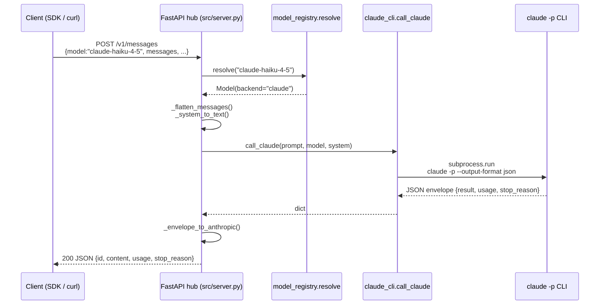
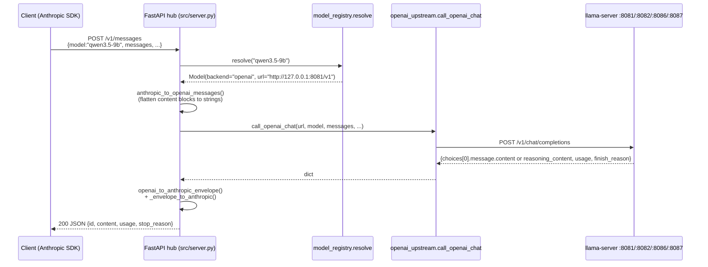

# Project structure

An LLM-oriented map of `local-llm-hub`. Three views: a **component
diagram** showing runtime data flow between clients, the hub, and the
backends (Claude subscription + local llama-server processes for
Qwen3.5-9B, GLM-4.5-Air, Gemma 4 E4B, Gemma 4 26B-A4B + whisper.cpp
ASR for both transcribe (turbo, GPU) and translate (medium, CPU));
a **module
diagram** showing the Python package layout and imports; and a
**request lifecycle** sequence. Use this file as context when asking
an LLM to modify the project — it shows which file owns what, and what
talks to what. For per-model specs, quantisation, and docs links see
[model-comparison.md](model-comparison.md).

## Component diagram (runtime)

```mermaid
flowchart LR
    subgraph Clients["External clients"]
        SDK["anthropic SDK<br/>(base_url=127.0.0.1:8000)"]
        OAI["openai SDK<br/>(base_url=127.0.0.1:8000/v1)"]
        CURL["raw HTTP / curl"]
        LAN["LAN clients<br/>(other machines, openclaw)"]
    end

    subgraph UI["Streamlit UI (app/)"]
        APP["app/app.py<br/>nav + CSS"]
        V_WELCOME["views/welcome.py"]
        V_INSTALL["views/install.py<br/>check + fix rows"]
        V_SERVER["views/server.py<br/>hub control + log"]
        V_CMP["views/comparison.py<br/>renders docs/model-comparison.md"]
        V_MODELS["views/models.py<br/>per-backend start/stop/log"]
        V_TEST["views/testing.py<br/>pytest + smoke"]
        V_PLAY["views/playground.py<br/>prompt → hub"]
    end

    subgraph Hub["FastAPI hub (src/)"]
        SRV["src/server.py<br/>POST /v1/messages<br/>POST /v1/chat/completions<br/>GET /v1/models /health /info /"]
        REG["src/model_registry.py<br/>YAML → Model rows"]
        HP["src/host_profile.py<br/>resolve active host"]
        LAND["src/landing.py<br/>HTML for GET /"]
        CLI_WRAP["src/claude_cli.py<br/>call_claude()"]
        OAI_UP["src/openai_upstream.py<br/>call_openai_chat()<br/>+ shape translators"]
    end

    subgraph Procs["Process managers"]
        SP["src/server_process.py<br/>hub Popen + log ring<br/>+ kill-port helper"]
        LP["src/backend_process.py<br/>per-model llama-server + whisper-server<br/>Popen + log ring"]
    end

    CLAUDE["claude -p CLI<br/>(Claude Code subscription)"]
    QWEN["llama-server :8081<br/>Qwen3.5-9B GGUF<br/>all layers on GPU"]
    GLM["llama-server :8082<br/>GLM-4.5-Air GGUF<br/>MoE experts on CPU"]
    GEMMA4E["llama-server :8086<br/>Gemma 4 E4B IT GGUF<br/>all layers on GPU"]
    GEMMA426["llama-server :8087<br/>Gemma 4 26B-A4B IT GGUF (MoE)<br/>all layers on GPU (IQ4_XS)"]

    subgraph Dev["Dev / tests / scripts"]
        SMOKE["scripts/smoke_test.py<br/>iterate enabled_models()"]
        DLMODELS["scripts/download_models.py<br/>huggingface_hub"]
        DLLLAMA["scripts/install_llama_cpp.py<br/>CUDA-win / Metal-mac"]
        INSTALL_CLI["python -m src.install [--fix]"]
        TESTS["tests/test_server.py<br/>test_router.py<br/>test_model_registry.py<br/>test_install.py"]
    end

    CFG[("config/models.yaml<br/>hosts + models")]
    YAML_CACHE["models/<br/>GGUF files (gitignored)"]
    LLAMA_BIN["vendor/llama.cpp/<br/>llama-server binary"]

    SDK -->|POST /v1/messages| SRV
    OAI -->|POST /v1/chat/completions| SRV
    CURL -->|both shapes| SRV
    LAN -->|both shapes<br/>(0.0.0.0:8000)| SRV
    V_PLAY -->|httpx POST| SRV
    SMOKE -->|HTTP + SDK| SRV

    SRV --> LAND
    SRV --> REG
    REG --> HP
    REG -.reads.-> CFG
    HP -.reads.-> CFG

    SRV -->|backend=claude| CLI_WRAP
    SRV -->|backend=openai| OAI_UP
    CLI_WRAP -->|subprocess.run<br/>--output-format json| CLAUDE
    OAI_UP -->|POST /v1/chat/completions| QWEN
    OAI_UP -->|POST /v1/chat/completions| GLM
    OAI_UP -->|POST /v1/chat/completions| GEMMA4E
    OAI_UP -->|POST /v1/chat/completions| GEMMA426

    APP --> V_WELCOME
    APP --> V_INSTALL
    APP --> V_SERVER
    APP --> V_CMP
    APP --> V_MODELS
    APP --> V_TEST
    APP --> V_PLAY
    V_SERVER -->|start/stop/logs<br/>kill stray PID| SP
    V_MODELS -->|start/stop/logs per model| LP
    V_TEST -->|pytest / smoke| SP
    V_PLAY -->|reachable? BASE_URL| SP
    V_INSTALL -->|run_all_checks / fix_fn_for| INSTALL_CLI

    SP -->|Popen python -m src.server| SRV
    LP -->|Popen llama-server --model ...| QWEN
    LP -->|Popen llama-server --model ...| GLM
    LP -->|Popen llama-server --model ...| GEMMA4E
    LP -->|Popen llama-server --model ...| GEMMA426
    LP -.reads.-> LLAMA_BIN
    LP -.reads.-> YAML_CACHE

    DLMODELS -.writes.-> YAML_CACHE
    DLLLAMA  -.writes.-> LLAMA_BIN
    INSTALL_CLI -.dispatches.-> DLMODELS
    INSTALL_CLI -.dispatches.-> DLLLAMA

    TESTS -->|TestClient<br/>(monkeypatched)| SRV

    classDef ext fill:#2a2f3a,stroke:#555,color:#eee
    classDef hub fill:#1d2a1d,stroke:#4a7,color:#eee
    classDef ui fill:#2a1d2a,stroke:#a47,color:#eee
    classDef backend fill:#2a281d,stroke:#a94,color:#eee
    class Clients ext
    class CLAUDE,QWEN,GLM,GEMMA4E,GEMMA426 backend
    class Hub hub
    class UI ui
```

## Module diagram (filesystem)

```mermaid
flowchart TB
    ROOT["local-llm-hub/"]
    ROOT --> README["README.md"]
    ROOT --> REQ["requirements.txt"]
    ROOT --> LIC["LICENSE"]
    ROOT --> LAUNCHERS["launchers/<br/>run_hub / run_qwen / run_glm / run_qwen35_4b / run_gemma4_e4b / run_gemma4_26b / run_whisper / run_all<br/>.bat (Windows) + .sh (macOS)<br/>launch_app.bat / .sh"]

    ROOT --> CFGDIR["config/"]
    CFGDIR --> C1["models.yaml<br/>hosts + models registry"]

    ROOT --> SRC["src/"]
    SRC --> S1["server.py<br/>FastAPI hub + router (local backends + Claude)"]
    SRC --> S2["claude_cli.py<br/>claude -p wrapper"]
    SRC --> S3["openai_upstream.py<br/>llama-server client +<br/>Anthropic ↔ OpenAI shapes"]
    SRC --> S4["model_registry.py<br/>YAML loader + Model class"]
    SRC --> S5["host_profile.py<br/>pick active host row"]
    SRC --> S6["install.py<br/>checks + fix dispatch"]
    SRC --> S7["run_backend.py<br/>hub|qwen|glm|qwen35_4b|gemma4*|whisper dispatcher"]
    SRC --> S8["server_process.py<br/>hub Popen + kill-port"]
    SRC --> S9["backend_process.py<br/>per-model Popen (llama-server + whisper-server)"]
    SRC --> S10["landing.py<br/>HTML for GET /"]
    SRC --> S11["whisper_translate_proxy.py<br/>FastAPI shim for optional lazy-load mode<br/>(dormant; whisper_translate runs eager)"]

    ROOT --> APPDIR["app/"]
    APPDIR --> A1["app.py<br/>Streamlit nav"]
    APPDIR --> A2["styles/light.css"]
    APPDIR --> A3["views/"]
    A3 --> V1["welcome.py"]
    A3 --> V2["install.py"]
    A3 --> V3["server.py"]
    A3 --> V4["comparison.py"]
    A3 --> V5["models.py"]
    A3 --> V6["testing.py"]
    A3 --> V7["playground.py"]

    ROOT --> SCDIR["scripts/"]
    SCDIR --> SC1["smoke_test.py"]
    SCDIR --> SC2["download_models.py<br/>huggingface_hub"]
    SCDIR --> SC3["install_llama_cpp.py<br/>CUDA-win / Metal-mac"]

    ROOT --> TDIR["tests/"]
    TDIR --> T1["test_server.py"]
    TDIR --> T2["test_router.py"]
    TDIR --> T3["test_model_registry.py"]
    TDIR --> T4["test_install.py"]

    ROOT --> VENDOR["vendor/<br/>(gitignored)"]
    VENDOR --> VLL["llama.cpp/<br/>llama-server binary"]

    ROOT --> MDLS["models/<br/>(gitignored)"]
    MDLS --> M1["Qwen3.5-9B-Q4_K_M.gguf"]
    MDLS --> M2["GLM-4.5-Air-Q4_K_M/<br/>multi-part GGUF"]
    MDLS --> M3["Qwen3.5-4B-Q4_K_M.gguf (agentic_light)"]
    MDLS --> M4["gemma-4-E4B-it-Q4_K_M.gguf (fallback)"]
    MDLS --> M5["gemma-4-26B-A4B-it-UD-IQ4_XS.gguf (MoE; agentic_heavy)"]
    MDLS --> M6["ggml-large-v3-turbo.bin (whisper turbo, transcribe)"]
    MDLS --> M7["ggml-medium.bin (whisper medium, translate)"]

    ROOT --> DOCS["docs/"]
    DOCS --> D1["project-structure.md<br/>(this file)"]
    DOCS --> D2["model-comparison.md<br/>per-model specs + docs links"]
    DOCS --> CHG["changelog/<br/>dated post-mortems + plan docs"]
    CHG --> D3["20260420-hub-with-qwen-and-glm.md"]
    CHG --> D4["20260420-add-gemma-for-action-item-classification.md"]
    CHG --> D5["20260420-glm-performance-assessment.md"]
    CHG --> D6["20260422-add-whisper-asr.md"]
    CHG --> D7["20260424-launchers-and-docs-reorg.md"]
```



## Request lifecycle

Two paths depending on backend; same entry point.

### Claude backend (model=claude-*)



### Local backend (model=qwen3.5-4b, gemma4-26b-a4b-it, plus qwen3.5-9b / glm-4.5-air / gemma4-e4b-it ad-hoc)



OpenAI-shape callers (`POST /v1/chat/completions`) skip the
Anthropic translation hops on both paths — for Claude the hub wraps
the envelope into OpenAI shape; for the local llama-server backends
(qwen35_4b/qwen/glm/gemma4-e4b/gemma4-26b-a4b) it's near-passthrough.

## Key facts for LLM context

- **Purpose.** Single local HTTP endpoint that speaks both Anthropic
  and OpenAI shapes and routes by model name to several backends:
  Claude subscription (via the `claude -p` CLI), local Qwen 3.5 4B
  (agentic_light), local Gemma 4 26B-A4B IT MoE (agentic_heavy),
  whisper.cpp ASR (turbo transcribe + medium translate), plus Gemma 4 E4B IT
  (fallback) and Qwen3.5-9B / GLM-4.5-Air (ad-hoc candidates). Lets
  clients (openclaw, anthropic/openai SDKs) keep one `base_url` and
  swap models via a string. See
  [model-comparison.md](model-comparison.md) for per-model specs.
- **One config, per-host filtering.**
  [`config/models.yaml`](../config/models.yaml) lists every model and
  every host. Each host has an `enabled` whitelist — the installer,
  the registry, the UI, and the smoke test all respect it, so nothing
  is downloaded, launched, or listed that this host hasn't opted into.
  Host resolution: `LOCAL_LLM_HUB_HOST` env var, else hostname
  match, else `default: true` row.
- **Entry points.**
  - `python -m src.run_backend hub` (or `run_hub.bat` / `.sh` at the
    repo root, or `tray.bat` on Windows) — starts FastAPI on
    `0.0.0.0:8000`.
  - `python -m src.run_backend qwen35_4b` / `gemma4_26b` / `whisper`
    / `whisper_translate` (active rotation), plus `qwen` / `glm` /
    `gemma4_e4b` (ad-hoc / fallback) (or the matching
    `launchers/run_*.bat` / `.sh`) — starts the matching
    `llama-server` / `whisper-server` child with args from
    `models.yaml`. The `whisper_translate` slot uses the
    `whisper-server` engine (eager-load, medium on CPU, ~1.5 GB RAM).
    A lazy-load alternative exists — set
    `engine: whisper-server-lazy` + `internal_port` + `idle_seconds`
    to route through `src/whisper_translate_proxy.py`, which
    spawns/unloads the child around an idle window — but the active
    rotation runs eager.
  - `python -m src.install [--fix]` — runs every health check, fixes
    the fixable; shared with the Streamlit Install tab.
  - `streamlit run app/app.py` (or `launch_app.bat` / `.sh` at the
    repo root) — UI.
- **Only two places shell out.**
  [`src/claude_cli.py`](../src/claude_cli.py) owns
  `subprocess.run(["claude", "-p", ...])`.
  [`src/backend_process.py`](../src/backend_process.py) owns the
  `subprocess.Popen(["llama-server", ...])` / `subprocess.Popen(["whisper-server", ...])`
  for each local model.
  Everything else is pure Python / FastAPI / httpx / Streamlit.
- **UI ↔ processes isolation.** The Streamlit app never imports the
  FastAPI app or the `llama-server` binary directly; it launches each
  as a child process and polls `/health` or `/v1/models`. That's why
  both process modules use module-level singletons (Streamlit reruns
  the script every interaction).
- **Tests don't touch Claude or the GPU.**
  [`tests/test_server.py`](../tests/test_server.py) and
  [`tests/test_router.py`](../tests/test_router.py) monkeypatch both
  `call_claude` and `call_openai_chat`. The real end-to-end check
  lives in [`scripts/smoke_test.py`](../scripts/smoke_test.py) and
  needs the hub plus the relevant backends running.
- **Intentional gaps.** No streaming. No tool-use translation between
  Anthropic ↔ OpenAI shapes (OpenAI-shape callers get tool calls
  natively from `llama-server --jinja`; Anthropic-shape callers to
  qwen/glm are text-only for now). Extended thinking, images, and
  multi-part content blocks are dropped at the shape boundary. See
  the README backlog for the ordered list.
