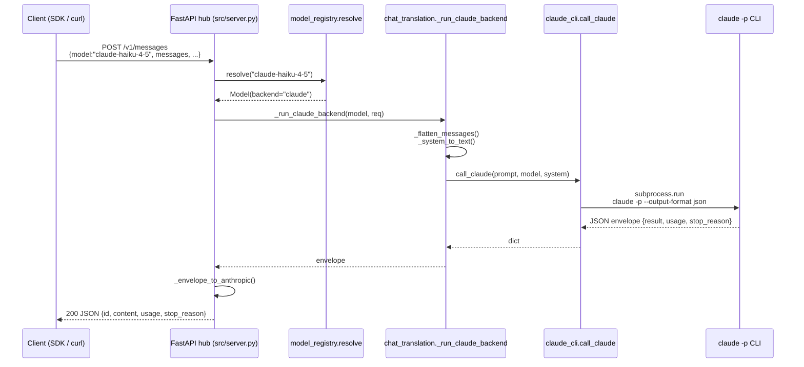
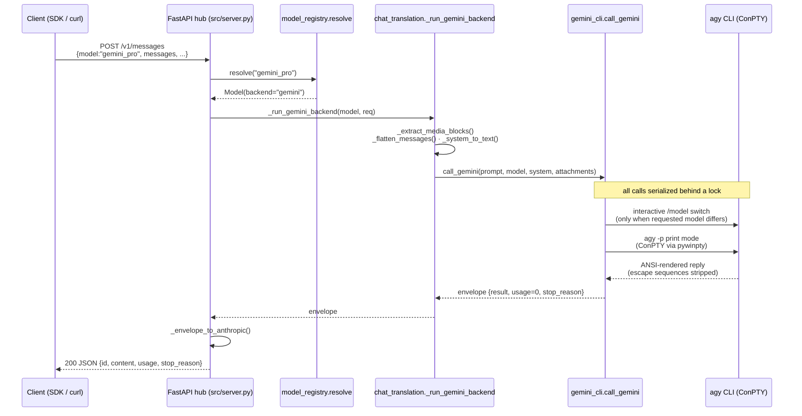
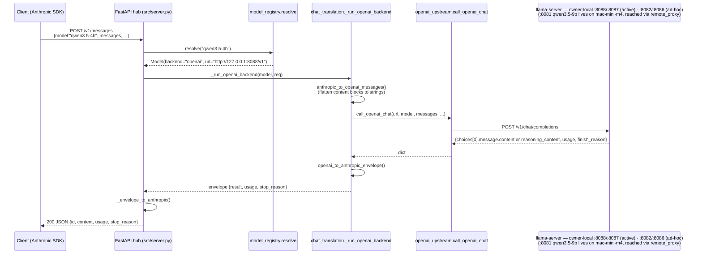
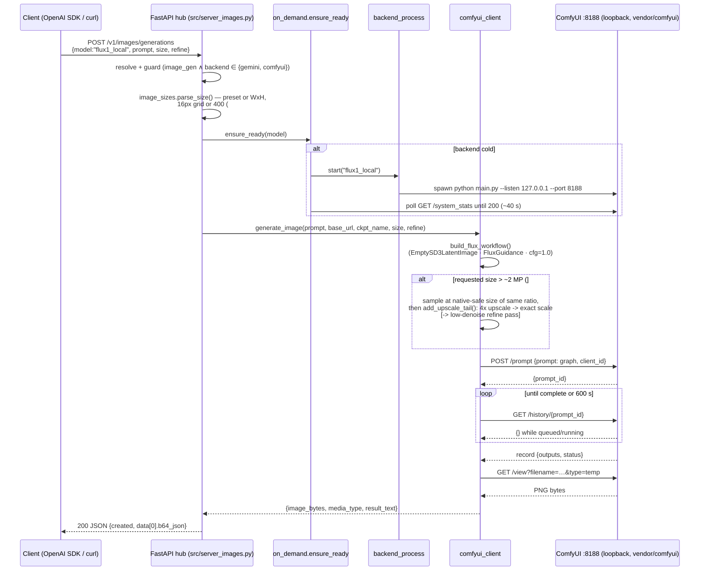

# Project structure

An LLM-oriented map of `local-llm-hub`. What lives **here** is the
**request lifecycle** — one sequence diagram per backend path — plus a
**key-facts** briefing to paste as context when asking an LLM to modify
the project. The two structural maps this file used to carry are owned
elsewhere and deliberately not restated: the **component diagram** in
[`architecture.mmd`](architecture.mmd) and the **filesystem layout** in
README.md's ["Layout"](../README.md#layout) section (`#452`).

For per-model specs, quantisation, and docs links see
[model-comparison.md](model-comparison.md). For **which machine owns which
model**, [`config/models.yaml`](../config/models.yaml) is the only source —
no doc in this repo restates placement.

## Component diagram (runtime)

Superseded as a standalone diagram — [`architecture.mmd`](architecture.mmd)
is the repo's one hand-maintained component/runtime map, and `CLAUDE.md`
puts it under a same-PR anti-staleness contract, which is exactly why it is
the one that stayed true. The second copy that used to live here drifted
(whisper moved to the `gaming` satellite, Qwen3.5-9B to `mac-mini-m4`, and
the audio / TTS / on-demand / failover / fleet-reconcile / diagnostics
surface never appeared in it at all) the same way the filesystem tree did
before `#452`. See it there rather than restating it in this file.

## Module diagram (filesystem)

Superseded as a standalone listing — README.md's ["Layout"](../README.md#layout)
section is the repo's one hand-maintained filesystem tree; keeping a second
one here let the two drift out of sync with each other and with the code
(`#452`). See it there rather than restating it in this file.

## Request lifecycle

Three paths depending on backend; same entry point.

### Claude backend (model=claude-*)

```mermaid
sequenceDiagram
    participant C as Client (SDK / curl)
    participant F as FastAPI hub (src/server.py)
    participant R as model_registry.resolve
    participant T as chat_translation._run_claude_backend
    participant W as claude_cli.call_claude
    participant K as claude -p CLI

    C->>F: POST /v1/messages<br/>{model:"claude-haiku-4-5", messages, ...}
    F->>R: resolve("claude-haiku-4-5")
    R-->>F: Model(backend="claude")
    F->>T: _run_claude_backend(model, req)
    T->>T: _flatten_messages()<br/>_system_to_text()
    T->>W: call_claude(prompt, model, system)
    W->>K: subprocess.run<br/>claude -p --output-format json
    K-->>W: JSON envelope {result, usage, stop_reason}
    W-->>T: dict
    T-->>F: envelope
    F->>F: _envelope_to_anthropic()
    F-->>C: 200 JSON {id, content, usage, stop_reason}
```

### Gemini backend (model=gemini_pro / gemini_flash / gemini_lite)

```mermaid
sequenceDiagram
    participant C as Client (SDK / curl)
    participant F as FastAPI hub (src/server.py)
    participant R as model_registry.resolve
    participant T as chat_translation._run_gemini_backend
    participant G as gemini_cli.call_gemini
    participant A as agy CLI (ConPTY)

    C->>F: POST /v1/messages<br/>{model:"gemini_pro", messages, ...}
    F->>R: resolve("gemini_pro")
    R-->>F: Model(backend="gemini")
    F->>T: _run_gemini_backend(model, req)
    T->>T: _extract_media_blocks()<br/>_flatten_messages() · _system_to_text()
    T->>G: call_gemini(prompt, model, system, attachments)
    Note over G,A: all calls serialized behind a lock
    G->>A: interactive /model switch<br/>(only when requested model differs)
    G->>A: agy -p print mode<br/>(ConPTY via pywinpty)
    A-->>G: ANSI-rendered reply<br/>(escape sequences stripped)
    G-->>T: envelope {result, usage=0, stop_reason}
    T-->>F: envelope
    F->>F: _envelope_to_anthropic()
    F-->>C: 200 JSON {id, content, usage, stop_reason}
```

`agy` surfaces no token counts, so the Gemini path reports usage as
zero. The model is global persisted CLI state (no per-call flag), which
is why a short interactive `/model` switch precedes print mode whenever
the requested Gemini row differs from the last-selected one.

### Local backend (model=qwen3.5-4b, gemma4-26b-a4b-it, plus glm-4.5-air / gemma4-e4b-it ad-hoc; qwen3.5-9b via the Mac Mini)

```mermaid
sequenceDiagram
    participant C as Client (Anthropic SDK)
    participant F as FastAPI hub (src/server.py)
    participant R as model_registry.resolve
    participant T as chat_translation._run_openai_backend
    participant U as openai_upstream.call_openai_chat
    participant L as llama-server — owner-local :8088/:8087 (active) · :8082/:8086 (ad-hoc)<br/>(:8081 qwen3.5-9b lives on mac-mini-m4, reached via remote_proxy)

    C->>F: POST /v1/messages<br/>{model:"qwen3.5-4b", messages, ...}
    F->>R: resolve("qwen3.5-4b")
    R-->>F: Model(backend="openai", url="http://127.0.0.1:8088/v1")
    F->>T: _run_openai_backend(model, req)
    T->>T: anthropic_to_openai_messages()<br/>(flatten content blocks to strings)
    T->>U: call_openai_chat(url, model, messages, ...)
    U->>L: POST /v1/chat/completions
    L-->>U: {choices[0].message.content or reasoning_content, usage, finish_reason}
    U-->>T: dict
    T->>T: openai_to_anthropic_envelope()
    T-->>F: envelope {result, usage, stop_reason}
    F->>F: _envelope_to_anthropic()
    F-->>C: 200 JSON {id, content, usage, stop_reason}
```

OpenAI-shape callers (`POST /v1/chat/completions`) skip the
Anthropic translation hops on both paths — for Claude the hub wraps
the envelope into OpenAI shape; for the local llama-server backends
(qwen35_4b/qwen/glm/gemma4-e4b/gemma4-26b-a4b) it's near-passthrough.

### Local image backend (model=flux1_local, issue #492)

The only lifecycle here that can **start its own backend mid-request**: the row
is `startup: on_demand`, so a cold request spawns ComfyUI and blocks on
readiness before any work is submitted. Note also that the job is asynchronous
on ComfyUI's side — the hub submits, then polls, rather than holding one long
request open.

```mermaid
sequenceDiagram
    participant C as Client (OpenAI SDK / curl)
    participant F as FastAPI hub (src/server_images.py)
    participant O as on_demand.ensure_ready
    participant B as backend_process
    participant K as comfyui_client
    participant X as ComfyUI :8188 (loopback, vendor/comfyui)

    C->>F: POST /v1/images/generations<br/>{model:"flux1_local", prompt, size, refine}
    F->>F: resolve + guard (image_gen ∧ backend ∈ {gemini, comfyui})
    F->>F: image_sizes.parse_size() — preset or WxH,<br/>16px grid or 400 (#497)
    F->>O: ensure_ready(model)
    alt backend cold
        O->>B: start("flux1_local")
        B->>X: spawn python main.py --listen 127.0.0.1 --port 8188
        O->>X: poll GET /system_stats until 200 (~40 s)
    end
    F->>K: generate_image(prompt, base_url, ckpt_name, size, refine)
    K->>K: build_flux_workflow()<br/>(EmptySD3LatentImage · FluxGuidance · cfg=1.0)
    alt requested size > ~2 MP (#497)
        K->>K: sample at native-safe size of same ratio,<br/>then add_upscale_tail(): 4x upscale -> exact scale<br/>[-> low-denoise refine pass]
    end
    K->>X: POST /prompt {prompt: graph, client_id}
    X-->>K: {prompt_id}
    loop until complete or 600 s
        K->>X: GET /history/{prompt_id}
        X-->>K: {} while queued/running
    end
    X-->>K: record {outputs, status}
    K->>X: GET /view?filename=…&type=temp
    X-->>K: PNG bytes
    K-->>F: {image_bytes, media_type, result_text}
    F-->>C: 200 JSON {created, data[0].b64_json}
```

After `idle_unload_minutes` without a request, `on_demand`'s watchdog stops the
backend again — which also clears ComfyUI's `temp` directory, where the
`PreviewImage` node writes generations. Editing (`/v1/images/edits`) does not
use this path; it stays on the gemini backend.

## Key facts for LLM context

- **Purpose.** Single local HTTP endpoint that speaks both Anthropic
  and OpenAI shapes and routes by model name to several backends:
  Claude subscription (via the `claude -p` CLI), Gemini subscription (via
  the `agy` Antigravity CLI, plus Imagen at `/v1/images/*`), FLUX.1 [dev]
  image generation on the local GPU via ComfyUI (#492), Qwen 3.5 4B
  (agentic_light) and Gemma 4 26B-A4B IT MoE (agentic_heavy) on
  llama-server, ASR at `/v1/audio/transcriptions|translations` (the
  whisper.cpp trio — turbo transcribe, medium translate, glossary-free
  vanilla — plus Parakeet on the Mac Mini's ANE), and TTS at
  `/v1/audio/speech` (Piper, Orpheus, Kokoro, Chatterbox), plus Gemma 4
  E4B IT (fallback) and Qwen3.5-9B / GLM-4.5-Air. Lets clients (openclaw,
  anthropic/openai SDKs) keep one `base_url` and swap models via a string.
  See [model-comparison.md](model-comparison.md) for per-model specs and
  [`config/models.yaml`](../config/models.yaml) for which host owns each row.
- **One config, per-host filtering.**
  [`config/models.yaml`](../config/models.yaml) lists every model and
  every host. Each host has an `enabled` whitelist — the installer,
  the registry, the UI, and the smoke test all respect it, so nothing
  is downloaded, launched, or listed that this host hasn't opted into.
  Host resolution: `LOCAL_LLM_HUB_HOST` env var, else hostname
  match, else `default: true` row.
- **Entry points.**
  - `python -m src.run_backend hub` (or `run_hub.bat` / `.sh` at the
    repo root, or `tray.bat` on Windows) — starts FastAPI on
    `0.0.0.0:8000`.
  - `python -m src.run_backend qwen35_4b` / `gemma4_26b` / `whisper`
    / `whisper_translate` / `chatterbox` (active rotation), plus
    `orpheus` (on-demand TTS) and `qwen` / `glm` / `gemma4_e4b`
    (ad-hoc / fallback) (or `launchers/run_model.bat` / `.sh <id>`,
    the parameterized launcher — #448) — starts the matching
    `llama-server` / `whisper-server` / TTS-shim child with args from
    `models.yaml`. The `whisper_translate` slot uses the
    `whisper-server` engine (eager-load, medium on CPU, ~1.5 GB RAM).
    The `piper` / `chatterbox` / `orpheus` / `kokoro` slots use the `tts-server` engine —
    the in-repo FastAPI shim `src/tts_server.py` (Orpheus runs a
    loopback `llama-server` child for its GGUF + SNAC decode).
    A lazy-load alternative exists — add `startup: on_demand` +
    `idle_unload_minutes` to the row (`src/on_demand.py`, #530: also the
    mechanism `whisper_vanilla` uses), which spawns/unloads the child
    around an idle window — but the active rotation runs eager.
  - `python -m src.install [--fix]` — runs every health check, fixes
    the fixable (CLI-only).
  - **Admin UI** — the `app_web/` SPA is a FastAPI sub-app mounted at
    `/admin` inside the hub process, so it comes up with the hub on
    `:8000`. Browse `http://127.0.0.1:8000/admin/` (`GET /` redirects
    there); no separate launcher.
- **Image generation.** `POST /v1/images/generations` and `/edits`
  (OpenAI Images shape) are handled by
  [`src/server_images.py`](../src/server_images.py), which routes by
  backend: `gemini` rows call `call_gemini_image()` in `src/gemini_cli.py`
  (Google **Imagen**, hosted as an agentic tool inside an `agy` Gemini
  text session — there is no Nano Banana / picker image model), and
  `comfyui` rows (`flux1_local`, `flux2_klein`, #492/#498) generate
  **entirely locally** on this host's own GPU via
  [`src/comfyui_client.py`](../src/comfyui_client.py). Editing
  (`/v1/images/edits`) stays on the `gemini` backend only — see
  [docs/image-generation.md](image-generation.md) for the full rationale.
- **Multi-host.** A model row can declare an owning `host:` (or an ordered
  `hosts:` preference chain) in `config/models.yaml`; when the active
  machine isn't the effective owner,
  [`src/remote_proxy.py`](../src/remote_proxy.py) resolves the owning
  host's own hub `base_url` and the request is forwarded there verbatim —
  a client never needs to know or care which machine actually runs a
  model. Today `qwen3.5-9b` and Parakeet ASR are owned by `mac-mini-m4`
  and the whisper.cpp STT trio by the `gaming` satellite (`#323`/`#370`),
  with [`src/model_failover.py`](../src/model_failover.py) picking the live
  owner along a chain; see the README's "Multi-host: the Mac Mini" section
  for the full walkthrough. Placement is the registry's to state — read it
  there, never from a doc.
- **The three backend-invocation entry points** are
  [`src/claude_cli.py`](../src/claude_cli.py) (owns
  `subprocess.run(["claude", "-p", ...])`),
  [`src/gemini_cli.py`](../src/gemini_cli.py) (spawns the `agy`
  Antigravity CLI under a Windows ConPTY via `pywinpty` for the
  `gemini-*` rows), and
  [`src/backend_process.py`](../src/backend_process.py) (owns
  `subprocess.Popen(["llama-server", ...])` /
  `subprocess.Popen(["whisper-server", ...])` for each local model). Many
  other modules also shell out for their own narrower purpose (installers,
  config writes, remote SSH, diagnostics sampling, the tray, per-script
  tooling) — this list is only the three that speak for an inbound LLM
  request.
- **Admin SPA runs inside the hub.** The `app_web/` sub-app is mounted
  at `/admin` in the same process as the public `/v1` surface, so its
  routers call the process managers in-process: `app_web/routers/hub.py`
  drives `src/hub_process_control.py` for self stop/restart and reads
  `src/server_process.py` for port/PID + ownership lookups, while
  `app_web/routers/models.py` drives `src/backend_process.py` to
  start/stop/tail each model backend, and the Play tab proxies through
  the hub's own `/v1/messages`. `backend_process.py` exposes a
  module-level singleton so the long-lived hub keeps one handle per
  child across requests; `server_process.py` holds no process handle of
  its own — the hub process is owned by whatever spawned it (the tray's
  own `HubProcess`, launchd, or systemd), not by this in-process module.
- **Tests don't touch Claude or the GPU.**
  [`tests/test_server.py`](../tests/test_server.py) and
  [`tests/test_router.py`](../tests/test_router.py) monkeypatch both
  `call_claude` and `call_openai_chat`. The real end-to-end check
  lives in [`scripts/smoke_test.py`](../scripts/smoke_test.py) and
  needs the hub plus the relevant backends running.
- **Intentional gaps.** Streaming and tool use both reach the Anthropic
  shape now: `/v1/messages` emits Anthropic SSE (#550) and translates
  `tools` / `tool_use` / `tool_result` against llama-server's OpenAI
  function calling (#552, refused with a 400 on the CLI backends, which
  flatten to one text prompt). Image and document content blocks
  (PDF plus text/data files) land on the `claude-*` / `gemini-*` paths;
  a `thinking: {"type": "enabled"}` request is refused with a 400 since
  the hub emits no thinking blocks (#607). `stop_sequences` / `top_p` /
  `top_k` reach llama-server; `stop_sequences` is refused on the CLI
  backends, which have no stop control.
